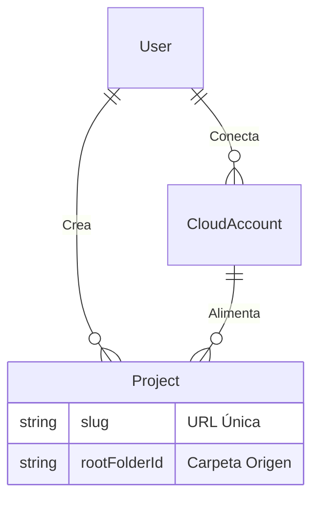

# Closerlens SaaS Master Plan: "Evolución sin Destruir"

Este documento consolida la estrategia técnica para transformar el prototipo de galería local en una plataforma SaaS escalable, cumpliendo con los requisitos de arquitectura visual y lógica.

## 1. Visión del Producto
Una plataforma donde fotógrafos (Usuarios) gestionan múltiples galerías (Proyectos), cada una alimentada por una carpeta específica en su nube (Google Drive), sin duplicar almacenamiento y manteniendo una estética "Pixieset".

---

## 2. Arquitectura "SaaS-Ready" (Implementada)

Hemos separado la aplicación en tres capas lógicas para cumplir con la regla de "Separar Usuario, Galerías y Fuente":

### A. Capa de Presentación (Frontend)
*   **Landing Page (`/`)**: Puerta de entrada pública.
*   **Constructor (`/demo`)**: Herramienta de venta/prueba que utiliza el motor real sin persistencia.
*   **Dashboard (`/dashboard`)**: Panel privado del fotógrafo. Gestión de estado (CRUD).
*   **Visor Público (`/g/[slug]`)**: La "Galería Final". Componente puro (`GalleryViewer`) optimizado para lectura.

### B. Capa de Datos (Backend & DB)
La base de datos (Prisma/SQLite -> Postgres) ya soporta la relación SaaS:

### C. Capa de Integración (Cloud Provider)
*   **Provider Pattern**: `GoogleDriveProvider` aísla la lógica de la API.
*   **Zero-Storage**: Solo guardamos tokens y IDs, nunca archivos físicos.

---

## 3. Hoja de Ruta de Consolidación

Aunque la estructura base está lista, estos son los pasos para cerrar las "cabos sueltos" y tener un MVP comercial:

### Fase 1: Consolidación del Core (✅ COMPLETADA)
- [x] Integración OAuth Google Drive estable.
- [x] Navegador de carpetas recursivo.
- [x] Componente `GalleryViewer` extraído y reutilizable.
- [x] Rutas dinámicas `/g/[slug]` funcionales.
- [x] Creación de Proyectos en DB desde el Dashboard.

### Fase 2: Autenticación Real (🚧 PRIORIDAD ACTUAL)
*Estado actual: Usamos un usuario "Admin Dev" por defecto.*
- [ ] **Integrar Auth.js (NextAuth)** o **Clerk**.
- [ ] Reemplazar el usuario mock (`admin@closerlens.dev`) por sesiones reales.
- [ ] Proteger rutas `/dashboard` con middleware.
- [ ] Lógica: Un usuario solo ve SUS proyectos y SUS cuentas.

### Fase 3: UX/UI Premium ("Pixieset Vibe")
*Estado actual: Funcional pero básico.*
- [ ] **Masonry Grid**: Implementar diseño tipo "mosaico" real (no solo columnas simples) para fotos verticales/horizontales mixtas.
- [ ] **Lighthouse Score**: Optimizar `next/image` para LCP (Largest Contentful Paint) verde en móviles.
- [ ] **Personalización**: Permitir al usuario elegir "Cover Image" desde el Dashboard.

### Fase 4: Seguridad y Entrega
- [ ] **Proxy de Imágenes**: Evaluar si los links de Google (`thumbnailLink`) expiran. Si es así, crear un proxy `/api/image/[id]` que refresque tokens transparentemente.
- [ ] **Protección por Contraseña**: Activar el campo `passwordProtected` del esquema para galerías privadas.

---

## 4. Reglas de Oro (Para desarrollo futuro)

1.  **Inmutabilidad del Archivo**: Nunca intentar escribir/editar la foto original en Drive. Solo lectura.
2.  **Un Proyecto = Una Carpeta**: No intentar mezclar múltiples fuentes. Mantiene la complejidad O(1).
3.  **Estética Primero**: Si la galería no se ve profesional, la funcionalidad no importa. Mantener el minimalismo.

## Siguiente Paso Recomendado
**Implementar Autenticación Real (Fase 2).**
Sin esto, el sistema no es multi-usuario. Actualmente cualquier persona que entre a `/dashboard` en tu local es "Admin".
